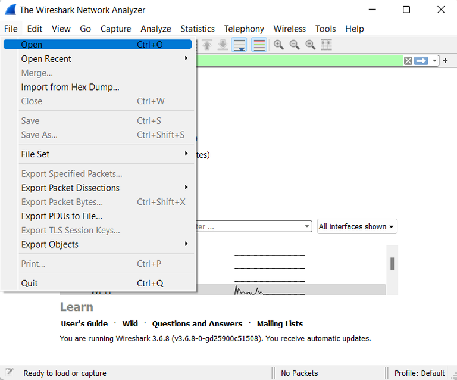
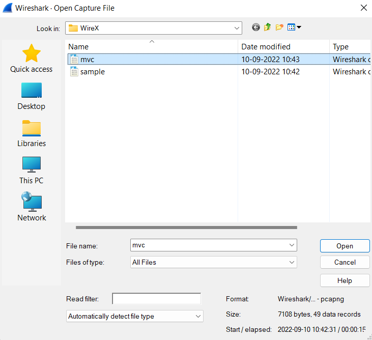

 <h1>Wireshark</h1>
 <h2>Steps to Open Capture Files in Wireshark</h2>
 <ul style="list-style-type:circle">
  <li>Firstly open the wireshark.</li>
  <li>Now go to the file.</li>
  <li>Then open the captuer file. </li>
</ul>





Saving Captured Packets:<br>
We can save a captured packet by using the menu items(save or save as). And also we can choose the file formate to use.
By using the save as dialog box which allow you to save the current capture to a file. 
<h2>Wireshark also supports different file formats from other capture tools :</h2>
<ul style="1">
<li>Oracle (previously Sun) snoop and atmsnoop captures</li>
<li>Tamosoft CommView captures</li>
<li>Finisar (previously Shomiti) Surveyor captures</li>
<li>Microsoft Network Monitor captures</li>
<li>Novell LANalyzer captures</li>
<li>Juniper Netscreen snoop captures</li>
<li>Symbian OS btsnoop captures</li>
</ul>

 <br>
<h2>Input file formates</h2>
 The formate used by Wireshake 
 <ul>
 <li>pcap-The default format used by the libpcap packet capture library.</li>
 <li>pcapng- A flexible, extensible successor to the pcap format. </li>
 </ul>
 Tools
 <ul>
 <li>tcpdump- It is use to capture packet and analysis network traffic(TCP, UDP, HTTP)</li>
 <li>Snort- It is a open source network intrusion detection system (NIDS) which analyzes traffic in real-time.It detects malicious activity, whish includes DoS attacks, port scans, and exploits.</li>
 <li>Nmap(network mapper)- is a powerful open-source tool used for network discovery, host detection, and vulnerability scanning.</li>
 <li>is a real-time traffic analysis tool.</li>
 </ul>

Source-https://www.geeksforgeeks.org/steps-to-open-capture-files-in-wireshark/

```

from scapy.all import rdpcap
pkts_list = rdpcap(r"D:\\Wireshark\\intern\\tcp.pcapng")
print(pkts_list.summary())

```
In ubuntu we can install a packet 

```

sudo snap install jq

```
We can count how many files is there 

```
wc -l

```
