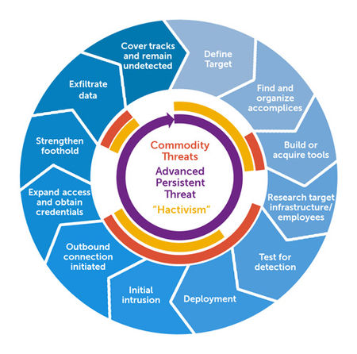

<h1>Basic Python Concept</h1>
print(): print function is used to print the output.

```
print("Hello World!!")


```

variable: It is use to store a vale. the value can be int, float, string, boolan.<br>
int is a number.<br>
string is written in a single ' ' or double quote " ".<br>
float is a decimal value.<br>
boolan is in the form of True or False.<br>

```
a= 5 
b= "Tenzin"
c= 5.2
d= True

```
Type cast: It is use to change the type of a variable.

```
a=float(5) output 5.0
b=int(6.5) output 7

```
input(): It is use to read input from keyboard.And it store value as string.

```
a=input("Enter the value:")

```
<h2>Arithmetic Operation</h2>

```
a=int(input("Enter the first number:"))
b=int(input("Enter the second number:"))

def operation():
    c=a+b
    d=a-b
    e=a*b
    f=a/b
    return c, d, e, f
print(operation())

```
<h2>Logical operator </h2>
or: if he one condition is true then the result will be true 

```
print(2>3 or 2>1) output True

```

and: both of the condition should be true.

```
print(2<3 and 3>1) output True

```

not: In not operator true will be flase and false will be true.

```
print(not 2>3) output True

```
After 2:00 a clock we have a session on Cybersecurity where I learn about the APT (advance persistent threat) and type of Malware in which we  talk about the virus, worm and trojan.In APT we discuss what is APT, it's objective and it's target.Later we discuss the lifecycle of APT.
<h2>Life Cycle</h2>
<ul>
<li>First we should know our target.</li>
<li>Then Build or buy the tools.</li>
<li>Then we have to know the target way of working and it's infrastructure.</li>
<li>Testing is done by sending the viruse again and again</li>
<li>After testing the tools is deploy.</li>
<li>It wait for the command from the hacker to do what (Delet,transfer.)</li>
<li>when the  infected system  contacts an external server controlled by the attacker.</li>
<li>After that it will be expand it reach in the network </li>
<li>they focus on strengthening their foothold to ensure long-term persistence in the network.</li>
<li>Then it will transfer the fill collected</li>
<li>After everything  is done it will clear every track and remain undetected</li>
</ul>


