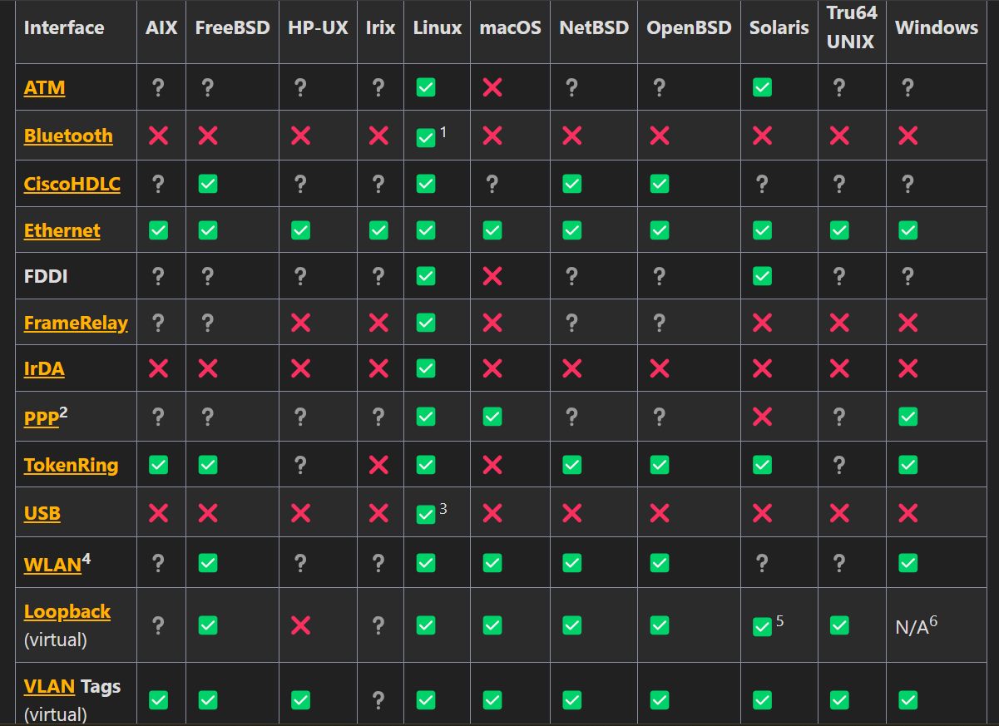

<h1>What is Wireshark?</h1>
It  is a network packet analyzer.And it will captured packet data in as much detail as possible.<br>
It is a measuring device for examining what's happend inside a network cable.<br>
<h2>Purposes</h2>
<ul>
<li>Network administrators use it to troubleshoot network problems</li>
<li>Network security engineers use it to examine security problems</li>
<li>QA engineers use it to verify network applications</li>
<li>Developers use it to debug protocol implementations</li>
<li>People use it to learn network protocol internals</li>
</ul>
To open the wireshark-> sudo wireshark<br>
capture filter- It is used as filter and show  same or specific  kind of  package(HTTP,TCP etc)<br>
display filter-If you want to selelctively select a file.
if we wand to see specific ip address


```

ip.addr== 192.168.154.136

```
If you want to see a specific source ip address.


```

ip.src==192.168.154.136

```


<h2>capture from many different network media,</h2>
Wireshark can capture traffic from many different network media types which include Ethernet, Wireless LAN, Bluetooth, USB, and more. <br>

<h2>Physical interfaces</h2>
Asynchronous- It means that data can be sent and receivedat different times without needed to be prefectly synchronized with the other device.<br>
<br>
<ul>
<li>ATM (Asynchronous Transfer Mode) – Captures ATM traffic.</li>
<li>Bluetooth – Captures Bluetooth traffic (currently limited to Affix stack on Linux).</li>
<li>CiscoHDLC (Cisco High-Level Data Link Control) – Captures on synchronous links using Cisco HDLC encapsulation.</li>
<li>DOCSIS (Data Over Cable Service Interface Specification) – Captures raw Cisco DOCSIS cable modem traffic forwarded to Ethernet.</li>
<li>Ethernet – Captures traffic on different Ethernet topologies, including switched networks.</li>
<li>FrameRelay – Captures Frame Relay traffic.</li>
<li>IrDA (Infrared Data Association) – Captures IrDA traffic (currently limited to Linux).</li>
<li>PPP (Point-to-Point Protocol) – Captures traffic on dial-up lines, ISDN (Integrated Services Digital Network) connections, and PPP-over-Ethernet (PPPoE, e.g., ADSL – Asymmetric Digital Subscriber Line).</li>
<li>SS7 (Signaling System No. 7) – Captures SS7 traffic on TDM (Time Division Multiplexing) links such as T1 (T-Carrier Level 1), E1 (E-Carrier Level 1), J1 (Japanese Carrier Level 1), T3 (T-Carrier Level 3), E3 (E-Carrier Level 3), and J3 (Japanese Carrier Level 3).</li>
<li>Token Ring – Captures traffic on Token Ring adapters, including in promiscuous mode and switched networks.</li>
<li>USB (Universal Serial Bus) – Captures raw USB traffic.</li>
<li>WLAN (Wireless Local Area Network) – Captures traffic on IEEE 802.11 interfaces (Wi-Fi), including "monitor mode," raw 802.11 headers, and radio information.</li>
</ul>

<br>

<h2>Virtual Interfaces</h2>
<ul>
<li>Loopback - capture traffic from a machine to itself, including the IP address 127.0.0.1</li>
<li>Pipes - use UNIX pipes to capture from other applications (even remote!)</li>
<li>VLAN - capture VLAN traffic, including VLAN tags</li>
<li>WinPcapRemote - WinPcap remote capturing (client for Win32, daemons for Win32 and Linux) - currently not working!</li>
</ul>

[Wireshark](https://www.youtube.com/watch?v=hGV8wsiCF28)


